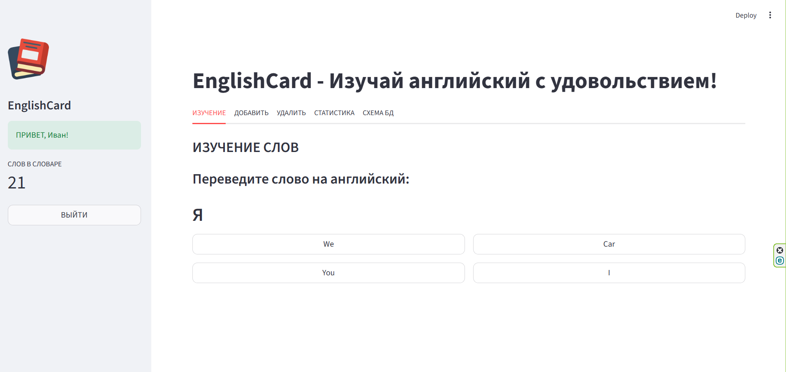

# 📚 EnglishCard — приложение для изучения английского языка

## Описание

EnglishCard — это веб-приложение для изучения английских слов в формате викторины. Приложение позволяет:

- Изучать слова с выбором перевода из 4 вариантов
- Добавлять персональные слова
- Удалять персональные слова
- Отслеживать статистику изучения
- Просматривать схему базы данных

## Скриншоты приложения



## Требования к системе

- Python 3.12 или выше
- PostgreSQL 14 или выше

## Установка и запуск

### 1. Клонирование репозитория

```bash
git clone https://github.com/ivanmyskov89-beep/english_card.git
cd english_card
